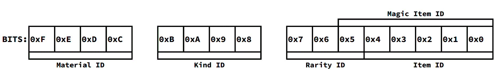

### ItemId Meaning

**ItemId** is a packed identifier which, in fact, stores more than a single value

It has a following structure:

[Material ID](../Enumerations/ALM/ItemMaterial.md) is related to a quality of an item. [Magic Item](../Enumerations/ALM/MagicItem.md) doesn't have this.

[Kind ID](../Enumerations/ALM/ItemKind.md) is related to a kind of an item. It could be a [Magic Item](../Enumerations/ALM/MagicItem.md), [Weapon](../Enumerations/ALM/WeaponItem.md), [Shield](../Enumerations/ALM/ShieldItem.md), or, in all other cases, a [Wieldable](../Enumerations/ALM/WieldableItem.md).

[Rarity ID](../Enumerations/ALM/ItemRariry.md) is related to a chance to find this kind of an item in the game, and, surprisingly, affects item's parameters and price similarly to a Material. [Magic Item](../Enumerations/ALM/MagicItem.md) doesn't have this.

**Item ID** is, in fact, an identifier in one of the following enumerations -- [[Weapons](../Enumerations/ALM/WeaponItem.md), [Shields](../Enumerations/ALM/ShieldItem.md), [Wieldables](../Enumerations/ALM/WieldableItem.md)] -- in the case of `Kind ID != Magic Item`

**Magic Irem ID** is, in fact, an identifier in [Magic Items](../Enumerations/ALM/MagicItem.md) enumeration in the case of `Kind ID == Magic Item`
